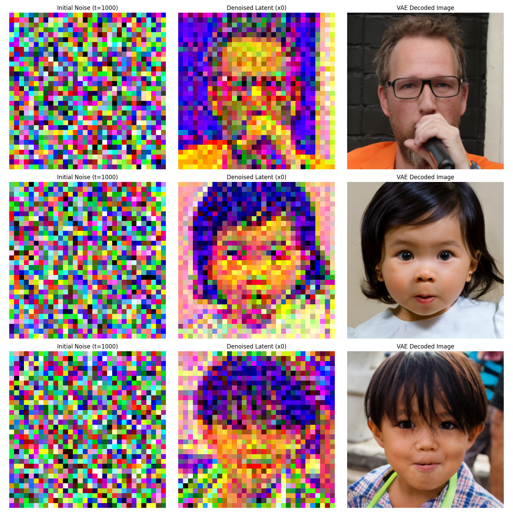

# Diffusion Transformer (DiT)

[](https://www.python.org/)
[](https://pytorch.org/)
[](https://huggingface.co/docs/diffusers/index)

This project implements an image generation model based on the **Diffusion Transformer (DiT)** architecture. It utilizes a Transformer to learn and predict the denoising process of a Diffusion Model. The project leverages the **diffusers** library for noise scheduling and performs operations within the Latent Space of a VAE to significantly improve generation efficiency and quality.

The model defaults to using Latent features from the FFHQ face dataset and is trained to predict the injected noise to restore the original data.

## 📂 Project Structure

```text
.
├── overfit_train.py            # Main training script (For overfitting tests)
├── eval.py                     # Evaluation script (Generates samples and static evaluation plots)
├── generate_gif.py             # Visualization script (Generates GIFs of the denoising process)
├── DiT/
│   ├── noise_predictor.py      # Core DiT Transformer architecture and EMA implementation
│   └── latent_dataset.py       # Utility for loading and processing the latent dataset
├── checkpoints_overfit/        # Directory for saving trained models (weights)
├── ffhq_latents_cache/         # Directory caching pre-encoded FFHQ latents
├── gifs/                       # Directory for storing generated GIF animations
└── README.md                   # Project documentation
```

## 🚀 Installation

### 1. Prerequisites
Ensure you have **Python 3.8+** installed. A virtual environment is recommended.

### 2. Install Dependencies
Install the required packages, including PyTorch, Diffusers, and Transformers.

```bash
# Core dependencies
pip install torch numpy matplotlib Pillow tqdm

# Diffusion model dependencies
pip install diffusers transformers
```

## 🖥️ Usage

### 1. Training (Overfitting Test)
Train the Diffusion Transformer on a small subset of FFHQ latents to verify model capabilities and architecture.

```bash
python overfit_train.py
```
*   **Process**: Loads latents from `ffhq_latents_cache`, initializes the DiT model, and optimizes using MSE loss on noise predictions utilizing the `DDPMScheduler`. The EMA (Exponential Moving Average) model weights are synchronously updated during training to enhance inference stability.
*   **Output**: Saves the trained model weights and EMA weights to the `checkpoints_overfit/` directory (e.g., `ema_only_overfit_step_5000.pth`).

### 2. Inference & Evaluation
Run the trained DiT model to evaluate the generated images and visually compare them with the initial Gaussian noise.

```bash
python eval.py
```
*   **Mechanism**: Operates using the `DDIMScheduler` for accelerated jump-step sampling (default is 100 steps) and decodes the generated latents back into pixel images using a pre-trained Stable Diffusion VAE (`stabilityai/sd-vae-ft-mse`).
*   **Config**: Ensure the `MODEL_PATH` in `eval.py` matches your saved model filename inside `checkpoints_overfit/`.
*   **Output**: Saves the generated comparison results directly to `evaluation_results.png`.

### 3. GIF Visualization
Visualize the detailed denoising reverse process step-by-step via a GIF animation.

```bash
python generate_gif.py
```
*   **Mechanism**: During the DDIM step-by-step sampling process, each latent step is immediately decoded by the VAE and recorded frame-by-frame to demonstrate the decoding transition.
*   **Output**: The generated animations are saved in the `gifs/` directory (e.g., `deblur_process_sample_0.gif`).

## 💡 Technical Highlights

- **Diffusion Transformer Architecture**:
  Treats noise prediction as a sequence modeling problem by substituting the commonly used U-Net with a scalable Transformer.
  - **Inputs**: (Noisy Latent, Timestep).
  - **Output**: Predicts the injected noise (Epsilon).
  
- **Latent Space Operation**: 
  Uses the pre-trained `SD-VAE` from the `diffusers` library to compress high-dimensional images into lower-dimensional 4-channel latents. This dramatically reduces the sequence length for the Transformer, making self-attention administratively and computationally feasible.

- **DDPM & DDIM Schedulers**: 
  Utilizes the standard `DDPMScheduler` for the forward noise injection during training, and `DDIMScheduler` for accelerated jump-step sampling during inference and visualization.

- **EMA (Exponential Moving Average)**: 
  Maintains an exponential moving average of the model parameters during training. This significantly smooths out training fluctuations and improves the visual fidelity of generated images.

- **Mixed Precision Training**:
  Integrates `torch.amp.autocast` (bfloat16) for mixed precision training, effectively boosting matrix computation speeds and drastically reducing GPU memory consumption.

## Result

